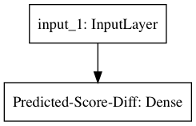
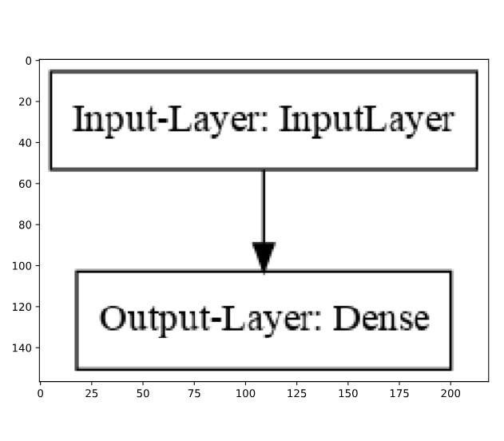

# Visualize a model #

Now that you've compiled the model, take a look a the result of your hard work! You can do this by looking at the model summary, as well as its plot.

The summary will tell you the names of the layers, as well as how many units they have and how many parameters are in the model.

The plot will show how the layers connect to each other.



## Instructions ##

* Summarize the model.
* Plot the model.

```python
# Import the plotting function
from keras.utils import plot_model
import matplotlib.pyplot as plt

# Summarize the model
model.summary()

# Plot the model
plot_model(model, to_file='model.png')

# Display the image
data = plt.imread('model.png')
plt.imshow(data)
plt.show()
```



```
    _________________________________________________________________
    Layer (type)                 Output Shape              Param #   
    =================================================================
    Input-Layer (InputLayer)     (None, 1)                 0         
    _________________________________________________________________
    Output-Layer (Dense)         (None, 1)                 2         
    =================================================================
    Total params: 2
    Trainable params: 2
    Non-trainable params: 0
    _________________________________________________________________
```