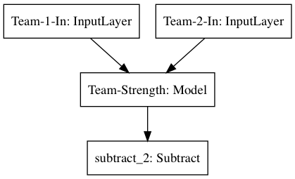

# Model using two inputs and one output #

Now that you have your two inputs (team id 1 and team id 2) and output (score difference), you can wrap them up in a model so you can use it later for fitting to data and evaluating on new data.

Your model will look like the following diagram:



## Instructions ##

* Define a model with the two teams as inputs and use the score difference as the output.
* Compile the model with the `'adam'` optimizer and `'mean_absolute_error'` loss.

```python
# Imports
from keras.layers import Subtract
from keras.models import Model

# Subtraction layer from previous exercise
score_diff = Subtract()([team_1_strength, team_2_strength])

# Create the model
model = Model([team_in_1, team_in_2], score_diff)

# Compile the model
model.compile(optimizer='adam', loss='mean_absolute_error')
```