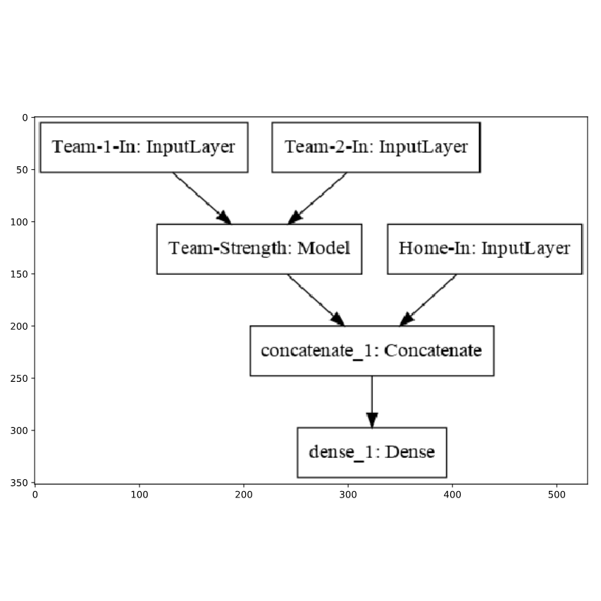

# Plotting models #

In addition to summarizing your model, you can also plot your model to get a more intuitive sense of it. Your `model` is available in the workspace.

## Instructions 1/4 ##

* Save the model plot to the file `'model.png'`.
* Import and display `'model.png'` into Python using `matplotlib`.

```python
# Imports
import matplotlib.pyplot as plt
from keras.utils import plot_model

# Plot the model
plot_model(model, to_file='model.png')

# Display the image
data = plt.imread('model.png')
plt.imshow(data)
plt.show()
```



## Instructions 2/4 ##

## Question ##
How many inputs does this model have?

## Answer: 3 ##

## Instructions 3/4 ##

## Question ##
How many outputs does this model have?

## Answer: 1 ##

## Instructions 4/4 ##

## Question ##
Which layer is shared between 2 inputs?

## Answer: Team-Strength ##